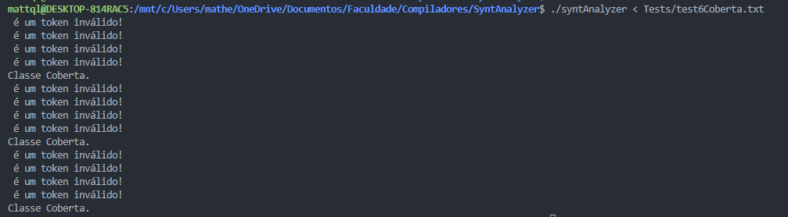

<h1><b>Instruções para execução do Projeto</b></h1>
<h3><b>Obs.: Informações sobre a lógica do projeto estão no arquivo Observações.txt</b></h3>

<b>-Instalações necessárias no ambiente Linux:</b>

    sudo apt update
    sudo apt upgrade
    sudo apt install g++ gdb
    sudo apt install make cmake
    sudo apt install flex
    sudo apt install bison

<b>-Extensões necessárias no VsCode:</b>
     Pacote C/C++ - Microsoft 
    CMake - twxs 
    Cmake Tools - Microsoft 
    Makefile Tools - Microsoft 
    Yash - daohong emilio

<b>-Compilar projeto:</b>

    ctrl + shift + b

<b>-Execução dos testes:</b>

    ./syntAnalyzer < Tests/test.txt
    ./syntAnalyzer < Tests/test1Primitiva.txt
    ./syntAnalyzer < Tests/test2Definida.txt
    ./syntAnalyzer < Tests/test3Axioma.txt
    ./syntAnalyzer < Tests/test4Aninhada.txt
    ./syntAnalyzer < Tests/test5Enumerada.txt
    ./syntAnalyzer < Tests/test6Coberta.txt
    ./syntAnalyzer < Tests/testeDados.txt

 <b>-Observações:</b>
    Ao executar o projeto com os comandos acima, caso apareça no terminal o seguinte erro:  <pre>"bash: ./syntAnalyzer: Permissão negada"</pre>
    Execute o comando abaixo no terminal e depois execute o projeto novamente:
    <pre>chmod +x syntAnalyzer</pre>

    Ao executar no WSL, caso a saida do terminal mostre várias linhas de: "é um token inválido!" como na imagem abaixo: 
    (A imagem é referente ao trabalho do Analisador Sintático mas o erro é o mesmo)
    
    Faça os passos abaixo para corrigir: 
    (O erro é um provável bug do WSL e não um problema do projeto) 
    
    1. Exclua a pasta do projeto
    2. Execute o comando no terminal do GIT, GIT Bash:

        git config --global core.autocrlf false

    3. Clone o projeto novamente, compile e execute

Caso apareça o seguinte erro no terminal:

    "./syntAnalyzer: /lib/x86_64-linux-gnu/libstdc++.so.6: version `GLIBCXX_3.4.32' not found (required by ./syntAnalyzer)"

Execute os comandos abaixo no terminal e teste a execução novamente:

    sudo add-apt-repository ppa:ubuntu-toolchain-r/test
    sudo apt-get update
    sudo apt-get install --only-upgrade libstdc++6

 <b>-Saída do terminal: </b>
    Os 6 tipos de classes estão organizadas da seguinte maneira: 
    • Classe primitiva: Número 1 e cor Verde 
    • Classe Definida: Número 2 e cor Azul 
    • Classe com axioma de fechamento: Número 3 e cor Amarelo 
    • Classe com descrições aninhadas: Número 4 e cor Magenta 
    • Classe Enumerada: Número 5 e cor Ciano 
    • Classe Coberta: Número 6 e cor Roxo  
    • Tipos de Propriedades são de cor Branco 
    • Erros são de cor Vermelho 
    • Alertas são de cor Laranja
